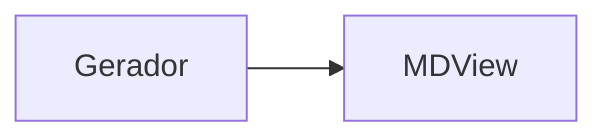

# MDView

Aplicacao estatica minimalista para escrever e visualizar Markdown no navegador.
Funciona com GitHub Pages e renderiza blocos Mermaid.

## Como usar

Abra `index.html` diretamente ou publique estes arquivos no GitHub Pages.

## Enviar Markdown por URL

```text
https://seu-anderitmo.github.io/visualizador-md-com-post/?md=%23%20Titulo%0A%0ATexto
```

O caractere `#` precisa ser enviado como `%23`, porque `#` sem escape inicia o
fragmento da URL no navegador. O MDView tambem tenta recuperar automaticamente o
caso `?md=#%20Titulo`, mas o formato recomendado e sempre codificar o conteudo.

Tambem e possivel enviar em base64 UTF-8:

```text
https://seu-anderitmo.github.io/visualizador-md-com-post/?md64=IyBUaXR1bG8KClRleHRv
```

## Receber Markdown por POST

Depois que o usuario abre o MDView uma vez, o Service Worker passa a interceptar
`POST /render` e `POST /post` no proprio navegador. Isso funciona sem backend,
mantendo a hospedagem compativel com GitHub Pages.

Endpoints aceitos:

```text
https://seu-anderitmo.github.io/visualizador-md-com-post/render
https://seu-anderitmo.github.io/visualizador-md-com-post/post
```

### Exemplo com formulario HTML

~~~html
<form action="https://seu-anderitmo.github.io/visualizador-md-com-post/render" method="post" target="_blank">
  <textarea name="markdown">
# Saida gerada


  </textarea>
  <button type="submit">Abrir preview</button>
</form>
~~~

### Exemplo com fetch usando JSON

```js
await fetch("https://seu-anderitmo.github.io/visualizador-md-com-post/render", {
  method: "POST",
  headers: {
    "content-type": "application/json",
  },
  body: JSON.stringify({
    markdown: "# Relatorio\n\nTexto em **Markdown**.",
  }),
});
```

### Exemplo com fetch usando form-urlencoded

```js
const body = new URLSearchParams({
  markdown: "# Relatorio\n\n- Item 1\n- Item 2",
});

await fetch("https://seu-anderitmo.github.io/visualizador-md-com-post/render", {
  method: "POST",
  headers: {
    "content-type": "application/x-www-form-urlencoded",
  },
  body,
});
```

### Exemplo com curl

```bash
curl -X POST "https://seu-anderitmo.github.io/visualizador-md-com-post/render" \
  -H "content-type: application/json" \
  -d '{"markdown":"# Relatorio\n\n```mermaid\nflowchart LR\nA --> B\n```"}'
```

Campos aceitos em `form-data`, `x-www-form-urlencoded` ou JSON: `markdown`,
`md` ou `content`. Se nenhum desses formatos for usado, o corpo puro da
requisicao sera tratado como Markdown.

Importante: como GitHub Pages nao executa servidor, o primeiro acesso precisa
ser um `GET` normal para instalar o Service Worker. Um `POST` feito antes disso
sera tratado pelo proprio GitHub Pages e nao pela aplicacao. Esse fluxo e ideal
para abrir o preview no navegador do usuario. Para chamadas de servidor para
servidor, use um endpoint serverless real e encaminhe para o MDView por URL ou
`postMessage`.

## Integrar com aplicacoes de terceiros

Para hospedagem estatica, o caminho recomendado e abrir o MDView em uma janela
ou iframe e enviar o conteudo com `postMessage`:

```html
<iframe id="mdview" src="https://seu-anderitmo.github.io/visualizador-md-com-post/"></iframe>

<script>
  const iframe = document.querySelector("#mdview");

  iframe.addEventListener("load", () => {
    iframe.contentWindow.postMessage(
      {
        type: "mdview:render",
        markdown: "# Saida gerada\n\n```mermaid\nflowchart LR\nA --> B\n```",
      },
      "https://seu-usuario.github.io",
    );
  });
</script>
```

## Sobre POST HTTP real no servidor

GitHub Pages hospeda arquivos estaticos e nao executa um servidor da aplicacao.
Por isso, o `POST` acima e interceptado pelo Service Worker no navegador, nao
por um processo server-side. Para um endpoint `POST /render` verdadeiro que
funcione no primeiro acesso e para chamadas de servidor para servidor, use um
pequeno proxy serverless, como Cloudflare Workers, Netlify Functions ou GitHub
Pages combinado com outro backend, e redirecione o conteudo para o MDView por
URL ou `postMessage`.
